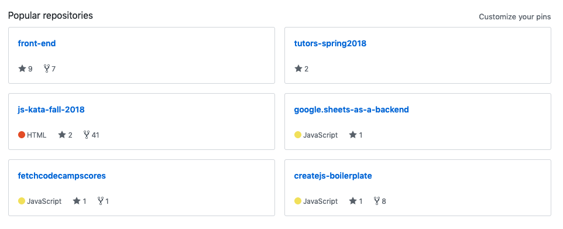

# JS-KATA

## 001 - Re-create this

### Your task

Your task is to re-create this:

The screenshot is available in the `materials/` folder.

**You can't use jQuery, Bootstrap, or any other framework!**

## Hints

- JS is not needed
- Think about your HTML, use "the right tags"
- "Steal" colors & icons from github: https://github.com/jofhatkea/
- It should be pretty easy to make responsive
- Did anyone say grid & flex together?
