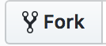

# JS-KATA

These are the exercises for the elective.

1.  Start by forking this repo to make it your own.
    

2.  Then clone it using something like `git clone https://github.com/jofhatkea/js-kata-autumn-2019.git`

3.  Everytime we change the original repository you should do a pull from our repository to grab the latest version (merging them into your own).
    `git pull https://github.com/jofhatkea/js-kata-autumn-2019.git`

## About the Exercises

The exercises are structured into folders, each containing a README.md file and a folder called mysolution.

The only place you should add or change files, is in that folder.

If you do it that way, there shouldn't be any conflicts.

The easy way to read the `.md` file is by going to your repo at github.com

If you spot a spelling error or have something to add, please do a pull request :-)

## Your solutions

Share your solutions in our slack workspace, don't be shy

You'll all learn from this 🖤

## Rules and Guidelines for the Katas

We have set down some rules for the katas, you should have the following in mind when solving each one

1. Use exactly 20 minutes to solve the task.
   (You are of course allowed to use more, but it's perfectly fine to stop after 20 minutes, even though you're not done.)
2. There will be a kata for all "non-project" days
